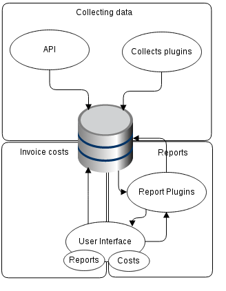
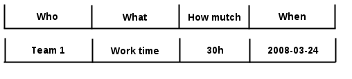

========
Overview
========

What is Scrooge? The simple answer for this question is: it is a "billing system for corporations". How does it work? It distributes costs of equipment, electricity, network, etc. to clients. For example, if you are COO or the chief accountant at a big company with numerous assets, projects and people, you probably need to know how many resources is used by each team or employee. Maybe you need to charge some people with these costs or just need financial statements to make an important decision. No matter why you need this information, you can obtain it from Scrooge. However, the first thing you need to know is that Scrooge is neither an Excel file nor an advanced calculator – it works on data collected from many devices or supplied by many people. It is a system to calculate and display results with many additional features that make it easier to use.

As you can see, we can distinguish three main parts of Scrooge architecture:
collecting data, supplying invoice costs and generating reports. This is the main idea of the system. Every month accountants provide invoice costs. This data is collected in the system plugin from many devices or people. The report section calculates everything and displays it in the form of a report where costs from invoices, based on devices or teams, are distributed to pre-defined clients.

The second feature of Scrooge is its flexibility. Look at the picture and find a cloud with a description starting with "report". You can see two places: one is used for collecting data and the other for generating reports. It means that we don't impose any method to generate or collect data. Of course, we have suggested one, but you don’t have to use it. There are a couple of rules on how to communicate plugins with core, but the collecting and data reporting algorithms are yours.

As you probably know, all financial statements must be imprinted historically as subtitles carved into the rock. Scrooge contains its own database where all incoming data is collected and imprinted forever in the basic form.

To be sure that generated reports will be the same forever, you can create a statement. Statements are saved in the database as a json with full data from the report so,if your crash your database manually and some data disappears, you can still go back to the old report by choosing a correct statement from the menu.

OK, but what if some of our clients generate costs of another clients? It is not a problem for Scrooge. In such case we can use services. A service is a bag where many clients are grouped and the total cost of this bag is distributed to other users. One thing that you need to do is to supply information which part of cost must be distributed to another client.

.. image:: images/services.png

Scrooge contains a few base plugins and tools for software developers, so you don't need to create everything from the scratch. The most complicated parts are coded by our software developers, so a few methods and features are ready to use, but you can find more about this in the source code and docstrings.

To sum up, the total client cost consists of 3 main parts: base cost, cost of another clients and extra costs. The last one is added manually and it can include e.g. a license cost. As you can see, Scrooge give you a possibility to implement all kinds of costs that a company may generate. Maybe it is not easy to implement it, but it is really flexible and has advanced business applications.
