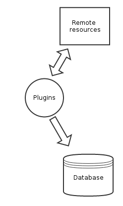
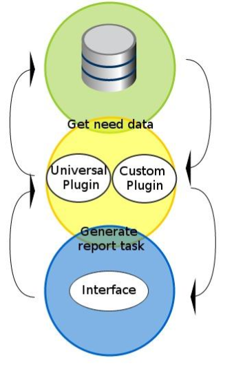

=======
Plugins
=======

There are two types of plugins. One of them is used to collect data from remote applications or servers; the other one called “report” is used to present results in the report.

The main goal of plugins is to create a universal and configurable logic for each new service and handle non-standard cases where the collect or/and report plugin contains more complicated logic and cannot be handled by a universal plugin. For example, if it is not possible to send usages data to Scrooge, you can go to Scrooge administrators and try to ask them to develop the collect plugin for you. This is not recommended, but possible (it is preferred to use push API). The second situation is when your service requires pre-processing before displaying results or contains a really complicated logic – you can also go to Scrooge administrators and ask them for help to create your own plugin, and again you can try to ask them to develop a report plugin for you. It is recommended to use a universal plugin and adjust your account logic to The Scrooge logic model.

Plugins use queues. Before it is run, every plugin is queued and waits for its turn.

Collect plugins
~~~~~~~~~~~~~~~

Collects plugins are used to collect data from remote sources. More specifically, collect plugins are used to collect base usages. Collect service usages are not advisable, so  create plugin for service usages is finality.

Each plugin is launched, for example, at 9 am and collects data all day. There is no base plugin etc. Each collect plugin contains a custom logic and as a result of its work, data is added/updated in the Scrooge database.

Report plugins
~~~~~~~~~~~~~~

Report plugins are used to generate columns in the report. Each plugin must return 2 pieces of information, column scheme and column value per venture. This is important because the column scheme is used to define and create additional columns in the report, but column value fill this columns for each venture. If a venture has no value for any column, 0.0 will be set as default. For default cases, we have created a universal plugin, so each service can use it when:

1. service was created
2. all usage types for this service were defined
3. service contains usage types
4. service contains percentage for each selected usage. (100 for only 1
   usage)
5. service contains selected base usages
6. service contains assigned ventures
7. usages were provided for each day.

Service and usages are configurable parts, so they can be selected from the Scrooge admin panel. For more information on how to do it, refer to the Services &
Usages section.

Report plugins used to calculate service costs require the cost of base usages. Base usages without costs are excluded from the total base service cost, so data from the report will be incorrect. More information about costs can be found in the Cost & Extra Costs section.

