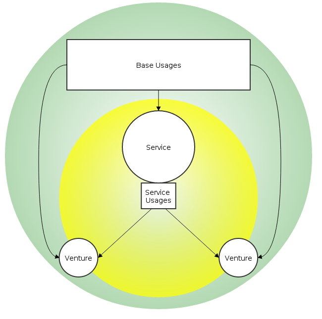
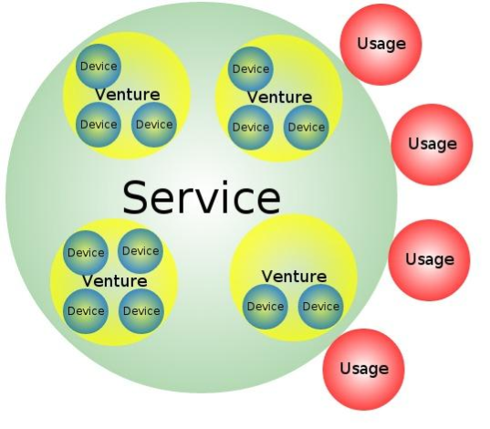
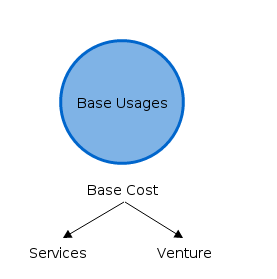

=================
Services & Usages
=================

The billing model implemented in Scrooge is based on services and usages. We can distinguish a service with service usages and base usages. Base usages are used to define a cost of venture/service for hardware. A service is a “bag” used to group many ventures (similarly, ventures are a bag used to group many devices). Service usage is used to calculate how much each client (ventures that used this service) should pay for using the service.

Services
~~~~~~~~
A venture is the base for calculating costs. Each venture contains a few devices and can use many services. A service is a bag to group many ventures. For example, when we create a service called Datastorage, we can include the following ventures:
datastorage_test and datastorage_production to create a “bag”
called Datastorage. The costs of datastorage_test and datastorage_production ventures are now included in the total costs of service called Datastorage. Now, we have two more ventures called webserviceA and webserviceB which use our Datastorage service (when I say “use Datastorage”, I mean they use some devices from datastorage_test and datastorage_production ventures).

Usages
~~~~~~
Usages contain basic and low-level values required by Scrooge to calculate and create a report.

Base usages
-----------
The usage give us information on how much a device costs. As you can imagine, every device in the datacenter uses power and probably internet, as well as space, and requires people to take care of it. Every device has also its purchase cost. To distribute costs, each device must contain information about the energy it consumes and space it occupies, which are its base usages defining how many units each device takes. To calculate the cost of a device, for example electricity cost, energy consumption units are counted to one value and divided by the electricity cost. Then, we have a price per one unit and when we multiply this price by the number of units for a single device we will have a price for this device.

Power consumption
  | Collect: *Each device model contains information about power consumption entered manually. The collect plugin collects this information every day and saves it as a simple “power consumption” abstract unit.*
  | Cost: *Accountants enter invoice costs manually.*
  | Report: *Cost of one unit is calculated by dividing total usages and total cost. The plugin sums all usages per venture and multiplies it by the cost of one unit.*
Height of device
  | Collect: *This base usage is collected exactly in the same way like power consumption.*
  | Cost: *Accountants enter invoice costs manually.*
  | Report: *This base usage cost per venture is calculated exactly in the same way like power consumption.*
Network
  | Collect: : *Usages are collected from nfsen servers per IP. Information about IT matching to Venture is collected from ralph. The plugin matches IP with Venture and save usages from nfsen as a venture usage. Unknown IPs are matched with the venture from settings.*
  | Cost: *Accountants enter invoice costs manually.*
  | Report: *This base usage cost per venture is calculated exactly in the same way like power consumption.*
Depreciation
  | Collect: *Each asset contains information about costs (more specifically, it is a device cost). The collect plugin collects this information as a daily device imprint.*
  | Cost: *Logistics specialists enter device (asset) cost manually.*
  | Report: *The cost for one day is calculated by dividing the device total cost and depreciation days which are calculated based on depreciation rate. The plugin sums all the costs per one day from all the devices and multiplies it by the number of days for which the report is generated.*
Teamwork
  | Collect: *Teams are based on collected data, so there is no any additional logic for it.*
  | Cost: *Accountants enter cost and teams number manually.*
  | Report: There are 4 ways to calculate teamwork costs.
  |     1. By time
  |     2. By devices and cores count
  |     3. By devices
  |     4. By cost distributed to other teams proportionally to team members count

Service usages
--------------

.. image:: images/service_usages.png

This type of usage is used to distribute service costs to ventures. Every day each service has to supply information to Scrooge on how it was used by each venture. Before supplying such information, service and usages must be defined together with the link from the admin panel. You can find more about how to create services and usages in the How to use section.

In the report, services are represented in columns with count and usage cost and one additional column with the total cost of service. The most important is “to know” that the service cost is the same as the total cost of ventures included in the service. A service is a mechanism to distribute costs of few ventures to other ventures.

One of big wins of Scrooge is its automatic plugin which gives you a possibility to add your service to our system without creating any code line. This plugin uses data that was supplied, services and usages that were created and linked, and returns complete biling information. Of course, if you need to present your data in your own style, you can try to create a dedicated plugin or do it yourself, but it is not recommended.

